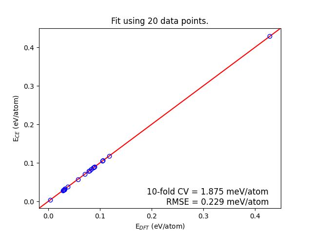
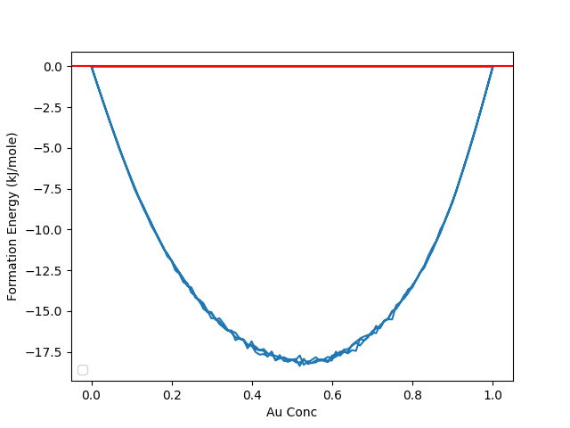

# Cluster Expansion Study of Au-Cu Alloy

Cluster Expansion (CE) modeling and Monte Carlo simulation of formation energies in the Au-Cu binary alloy system, using the CLEASE framework.

## Overview

This project fits a Cluster Expansion model to the Au-Cu FCC alloy system with L1 regularization, then uses Monte Carlo simulations to compute formation energies across the full composition range at multiple temperatures.

## Methods

- **Cluster Expansion Fitting** (`clusters.py`) — fits effective cluster interactions (ECIs) using 10-fold cross-validation with L1 (LASSO) regularization to select the optimal regularization strength
- **Monte Carlo Simulation** (`energy.py`) — canonical Monte Carlo at 100 K, 500 K, and 800 K across Au concentrations to compute formation energies (kJ/mol)

## Results

- **L1 Regularization:** cross-validation score plot for selecting the optimal alpha parameter

  

- **Formation Energy:** formation energy vs. Au concentration at different temperatures

  

## Project Structure

| File | Description |
|------|-------------|
| `clusters.py` | CE fitting with L1 regularization and ECI extraction |
| `energy.py` | Monte Carlo formation energy calculations |
| `eci_l1.json` | Fitted effective cluster interactions |
| `aucu.db` | ASE atoms database for the Au-Cu system |

## How to Run

```bash
pip install clease ase numpy matplotlib
python clusters.py   # Fit the cluster expansion
python energy.py     # Run Monte Carlo and plot formation energies
```

## Dependencies

- [CLEASE](https://clease.readthedocs.io/) — Cluster Expansion in Atomic Simulation Environment
- ASE (Atomic Simulation Environment)
- NumPy, Matplotlib, pandas
